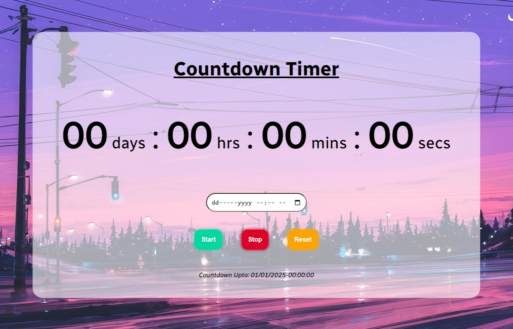

---

# Countdown Timer

A simple and responsive countdown timer built using **HTML**, **CSS**, and **JavaScript**.

## Features

- Input for selecting date and time
- Start, Stop, and Reset buttons
- Responsive UI for mobile and desktop
- Live countdown display
- Shows the selected countdown target (date & time)

## Tech Stack

- **HTML**: Structure of the application.
- **CSS**: Styling for an intuitive and minimal design.
- **JavaScript**: Handles task management and interactions.

## Deployment

This web app is deployed using [Vercel](https://vercel.com/) by Tiger. You can access the live version here: [Countdown Timer](https://countdown-timer-navy-chi.vercel.app/)

## ScreenShots

## Getting Started

To run the app locally:

1. Clone this repository.
2. Navigate to the project folder.
3. Open `index.html` in your browser.

## License

This project is licensed under the MIT License - see the [LICENSE](LICENSE) file for details.

## Author

Made with ❤️ by Tiger

---